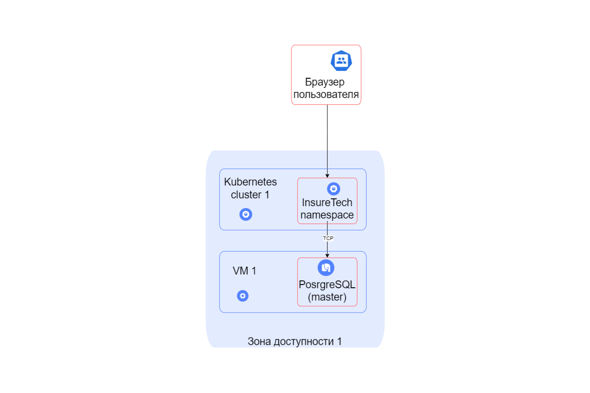
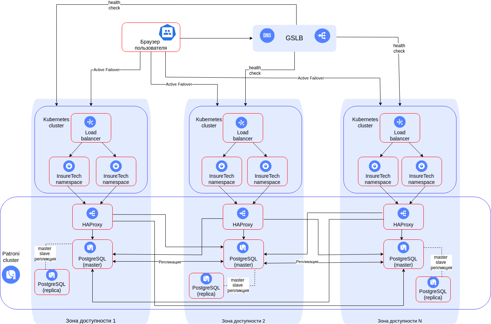
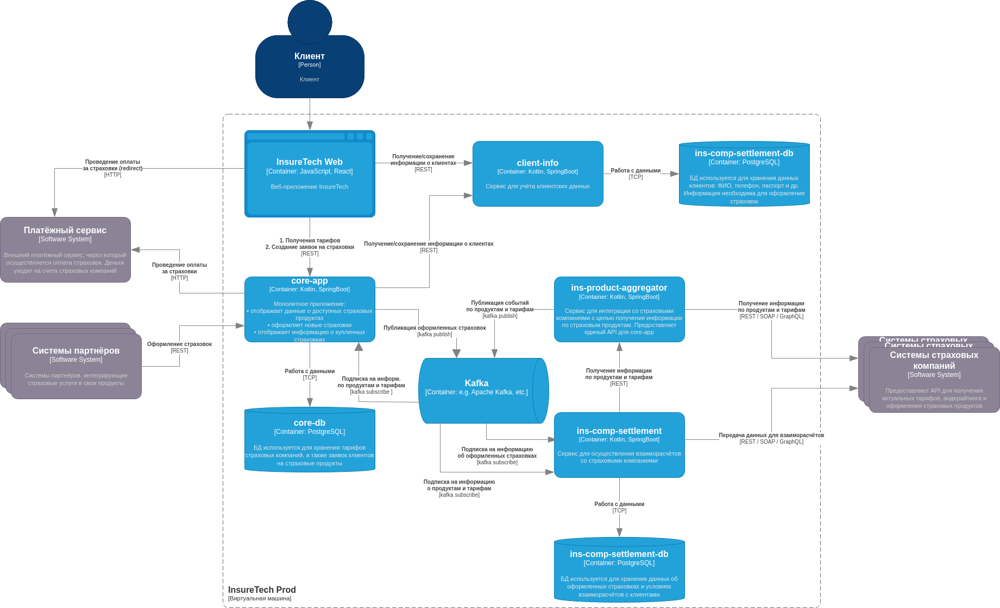

# Задания к спринту 6 "Создание highload в realtime-среде"

## Описание кейса

На этот раз вы выступите в роли архитектора ПО для InsureTech. Компания предоставляет агрегационные услуги в сфере страхования. Она работает с частными и корпоративными клиентами:
- частным клиентам компания предлагает удобный сайт для подбора и оформления страховок,
- корпоративным клиентам и партнёрам предоставляет API для интеграции страховых услуг в их продукты.

Сейчас основной продукт InsureTech — это страхование жизни.

### Проблемы компании
Компания успешно запустила MVP своего приложения и планирует активно развиваться дальше. Всё бы хорошо, но приложение столкнулось со всеми классическими проблемами быстрого роста:
1. **Сайт медленно загружает страницы.** Когда нагрузка на приложение повышается, пользователи массово жалуются на то, что страницы грузятся по несколько минут или не загружаются вообще. При этом максимально зафиксированная нагрузка на запросы поиска составила 50 RPS, а на запросы оформления — 10 RPS. Такое положение дел плохо влияет на показатели NPS и retention.
2. **Нарушается SLA для B2B-клиентов.** Менеджеры уже неоднократно получали сообщения от партнёров, что SLA API не соответствует заявленному. В ходе изучения таких инцидентов выяснилось, что в эти периоды количество запросов от одного из партнёров кратно возрастало. Оно достигало суммарно 250 RPS на все вызываемые операции. По сути, один из партнёров «сжирал» все ресурсы приложения. С этим партнёром изначально договорились, что нагрузка не будет превышать 20 RPS.
3. **Приложение падает.** InsureTech несколько раз столкнулась с проблемой недоступности приложения. Команда реагировала на проблему очень медленно, поскольку узнавала о ней от пользователей. Каждый час простоя сервис несёт финансовые убытки — примерно 500 тысяч рублей. Также бизнес несёт репутационные потери: в СМИ выходят негативные публикации, у сервиса низкие показатели удовлетворённости пользователей, а некоторые партнёры уже заявили о нежелании продлевать сотрудничество.
   
InureTech планирует в ближайшее время провести большую рекламную кампанию. Ожидается существенный прирост пользователей.
   
Вам как архитектору нужно проработать описанные проблемы и предложить для них решения. В текущем состоянии приложение является «узким горлышком» для развития бизнеса.

### Архитектура приложения
Основные компоненты приложения:
- **core-app** — монолитное бэкенд-приложение. Оно отвечает за отображение доступных клиенту продуктов, оформление заявок на новые страховки и отображение уже оформленных.
- **client-info** — сервис управления клиентскими данными. Он передаёт данные core-app для оформления страховок. Если пользователя нет в базе данных или его данные изменились, в процессе оформления страховки сервис client-info вносит данные в базу. Он же отвечает за отображение и редактирование клиентских данных в личном кабинете.
- **ins-product-aggregator** — сервис интеграции со страховыми компаниями для получения информации о продуктах. Ещё он запрашивает у разных партнёров предложения по ОСАГО для конкретного автомобиля. Сервис предоставляет единый API, агрегируя данные от всех страховых компаний.
- **ins-comp-settlement** — сервис взаиморасчётов со страховыми компаниями. Раз в месяц он отправляет перечень оформленных страховок в страховые компании для расчёта выплаты агентских премий.
- Веб-приложение для клиентов сервиса.
   
Для деплоя всех приложений используется кластер Kubernetes, расположенный в одной зоне доступности.
   
В качестве базы данных используется PostgreSQL. Каждый сервис, использующий БД, имеет отдельную схему данных. БД развёрнута на отдельной ВМ в единственном экземпляре.
   
Взаимодействие между фронтендом и бэкендом происходит посредством REST.
   
API предоставляет партнёрам доступ напрямую через LoadBalancer Kubernetes, который доступен в сети Интернет.
   
Бэкенд-приложение интегрировано с пятью страховыми компаниями.
   
Вот диаграмма контейнеров приложения в модели C4:

## Задачи 

### Задание 1. Проектирование технологической архитектуры

Компания хочет сделать упор на развитие в регионах РФ. Планируется значительный рост количества пользователей и запросов. Нужно обеспечить бесперебойную работу сервиса 24/7, при этом сервис должен обслуживать клиентов из всех часовых поясов.
   
Требования к отказоустойчивости системы крайне высокие: RTO — 45 мин., RPO — 15 мин. Согласно требованиям бизнеса, доступность приложения должна быть равна 99,9%.
   
Дополнительно к этому нужно обеспечить одинаковое время загрузки страниц для пользователей из разных регионов. Оно не должно зависеть от географического местоположения пользователя.
   
На текущий момент сервис хранит ограниченный набор данных, который включает в себя:
- базовую информацию о клиентах — ФИО, контакты, документы,
- информацию о продуктах и тарифах,
- историю заявок клиентов.

Общий объём данных, которые хранятся в системе, равен 50 GB.

**Задание**: Необходимо спроектировать технологическую архитектуру приложения так, чтобы оно отвечало требованиям бизнеса. Создайте схему итогового решения на основании текущей технологической архитектуры сервиса.

Вот схема текущей архитектуры:

**Решение:**

### Задание 2. Динамическое масштабирование контейнеров

Вы будете тестировать динамическое масштабирование на примере простого приложения. Оно предоставляет два ресурса:
- GET / — получение идентификатора пода;
- GET /metrics — получение метрик в формате Prometheus.
   
Метрика http_requests_total возвращает количество запросов для метода получения идентификатора пода.

https://hub.docker.com/r/shestera/scaletestapp - Образ тестового приложения. Оба метода приложения доступны по порту 8080.

**Задание:**
1. Поднимите локальный кластер Kubernetes в Minikube.
2. Активируйте metrics-server.
3. Напишите манифест развёртывания (Deployment) Kubernetes для запуска тестового приложения. Для начального количества реплик установите значение, равное единице. Лимит памяти установите равный “30Mi”.
4. Напишите и примените манифест сервиса (Service) для доступа к приложению, которое вы установили на прошлом шаге. 
5. Настройте динамическую маршрутизацию на основании показателей утилизации оперативной памяти с помощью Horizontal Pod Autoscaler (HPA). Для нашего тестового приложения оптимальный уровень утилизации памяти равен 80%. В качестве максимального количества реплик рекомендуем установить 10. 
6. Настройте динамическую маршрутизацию на основании показателей утилизации оперативной памяти с помощью Horizontal Pod Autoscaler (HPA). Для этого нужно активировать поддержку метрик в вашем кластере. 
7. Воспользуйтесь инструментом нагрузочного тестирования locust

**Решение:**

- `Task2/scaletestapp-deployment.yml` - манифест развёртывания (Deployment) Kubernetes для запуска тестового приложения
- `Task2/scaletestapp-service.yml` - манифест сервиса (Service) для доступа к приложению
- `Task2/scaletestapp-hpa.yml` - манифест для Horizontal Pod Autoscaler
- `Task2/locustfile.py` - сценарий на Python (Locustfile)
- скриншоты дашборда:
	- `Task2/Screenshot-1-pod.png`
	- `Task2/Screenshot-2-pods.png`

### Задание 3. Переход на Event-Driven архитектуру

Сервисы core-app и ins-comp-settlement получают данные о доступных продуктах через REST API сервиса ins-product-aggregator. В момент вызова он:
- запрашивает информацию из всех страховых компаний (сейчас их пять),
- агрегирует её в единый список,
- возвращает этот список в рамках того же синхронного запроса.
   
Чтобы ускорить работу сервисов, при изначальном проектировании команда решила хранить локальные реплики данных о продуктах и тарифах в сервисах core-app и ins-comp-settlement.
   
Сервис core-app осуществляет запрос к ins-product-aggregator раз в 15 минут, а ins-comp-settlement — раз в сутки (ночью), при формировании реестра оформленных страховок. Иногда команда сталкивается с ошибками взаимодействия между этими сервисами. Они связаны с задержками ответов или ошибками при взаимодействии с API страховых компаний.
   
Дополнительно сервис ins-comp-settlement раз в сутки осуществляет запрос в core-app по REST API для получения всех оформленных за день страховок. Эти данные он использует. 
   
В ближайшее время InsureTech планирует подписать агентское соглашение ещё с пятью страховыми компаниями. Вам предстоит спроектировать решение, которое устранит текущие проблемы.

**Задание:**
1. Проанализируйте текущую архитектуру. Создайте текстовый документ и напишите там список проблем и рисков, которые связаны с планируемым ростом нагрузки. 
2. Обновите диаграмму контейнеров InsureTech, предложив решения для выявленных вами рисков и проблем. При этом:
- Не меняя декомпозицию функциональности между сервисами, подумайте, какие взаимодействия стоит переделать на Event-Streaming.
- Решите, будете ли вы использовать паттерн Transactional Outbox.

**Решение:**
- `Task3/Task_3.md` - анализ текущей архитектуры
- `Task3/InsureTech_C4_сontainer-diagram-new.drawio.xml` - новая диаграмма контейнеров InsureTech

### Задание 4. Проектирование продажи ОСАГО

### Задание 5. Проектирование GraphQL API

### Задание 6. Настройка Rate Limiting

